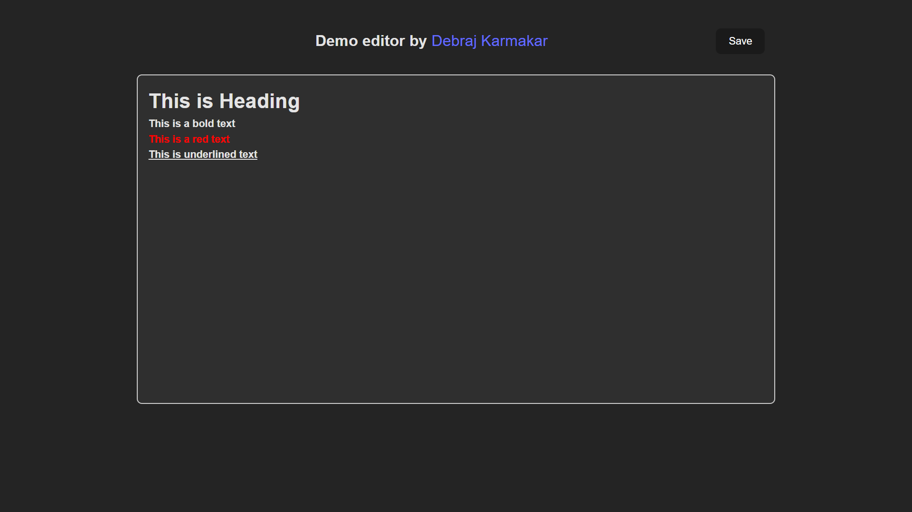

# Editoraft

##  Rich Text Editor using Draft.js within ReactJS with the following specifications
- The editor written in Draft.js
    - `#` as the first string in a line & pressing space make anything you type afterwards on the same line be in a “Heading” format. On pressing space the aforementioned `#` disappear.
        - See “This is Heading” line in the layout image above.
    - `*` as the first string in a line and pressing space correspond to “bold” format
    - `**` and space = red line
    - `***` and space = underline
- Pressing `Save` button persist everything typed in the editor into `localstorage`. On refreshing the page,  the saved info refilled into the editor.

# 👨🏻‍💻 Technology used
- HTML
- CSS
- Vite
- JavaScript
- React.js
- Draft.js
